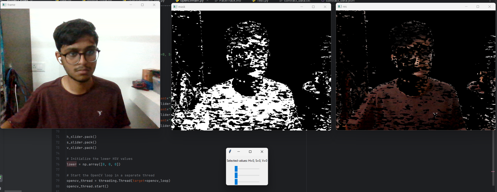
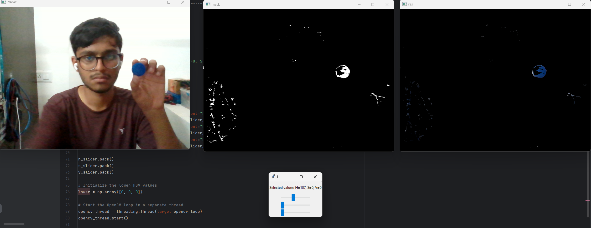

<!DOCTYPE html>
<html lang="en">

<head>
    <meta charset="UTF-8">
    <meta name="viewport" content="width=device-width, initial-scale=1.0">
   
</head>
<body>
    <h1>OpenCV HSV Color Picker</h1>
    
This Python script provides a simple graphical user interface (GUI) for selecting lower HSV (Hue, Saturation, Value) values using sliders. It utilizes the OpenCV library to capture video frames from a webcam, apply an HSV color filter based on the selected lower and upper HSV values, and display the original frame, mask, and resulting image.

    <h2>Features</h2>
    <ul>
        <li>Adjustable sliders for setting lower HSV values (Hue, Saturation, Value).</li>
        <li>Real-time visualization of the original frame, mask, and resulting image.</li>
        <li>Multi-threaded implementation to run the OpenCV loop concurrently with the Tkinter GUI.</li>
    </ul>
    <h2>Requirements</h2>
    <ul>
        <li>Python 3.x</li>
        <li>OpenCV (cv2)</li>
        <li>Tkinter</li>
    </ul>
    <h2>How to Use</h2>
    <ol>
        <li>Ensure you have Python installed on your system.</li>
        <li>Install the required libraries using the following command:</li>
    </ol>
    <code>pip install opencv-python numpy</code>
    <ol start="3">
        <li>Run the script (<code>opencv_hsv_color_picker.py</code>).</li>
        <li>Adjust the H, S, and V sliders to select the desired lower HSV values.</li>
        <li>The GUI will display real-time updates of the original frame, mask, and resulting image.</li>
        <li>Press the 'Esc' key to exit the application.</li>
    </ol>
    <h2>Notes</h2>
    <ul>
        <li>The script captures video frames from the default camera (camera index 0). You can modify the <code>cv.VideoCapture(0)</code> line to specify a different camera if needed.</li>
        <li>The OpenCV loop runs in a separate thread to ensure responsiveness of the Tkinter GUI.</li>
    </ul>
    <h2>Images</h2>
    
    
    
    
    
Feel free to explore and modify the script based on your needs. For any questions or issues, please create an <a href="https://github.com/yourusername/your-repo/issues">issue</a> on the GitHub repository. Happy coding!

</body>

</html>
